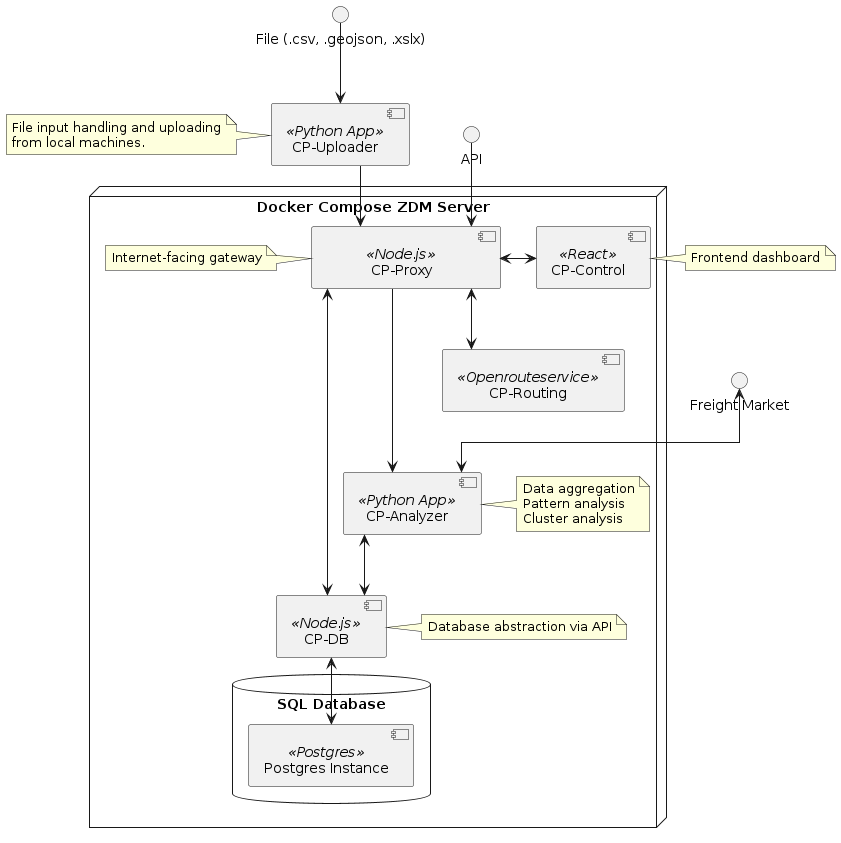

# Introduction

Cargo Pilot is a full-stack application designed to analyze truck trip data and find potential for load optimisation. The project aims to provide a comprehensive solution for analyzing the flow of cargo shipments by leveraging data analysis techniques.

>**_NOTE:_**  Work in Progress: Some of the described features are not released yet!

### Features

* Data Import: Easily import truck load data from various sources, such as CSV files or the provided API.
* Pattern Detection: Identify patterns in the truck tour data.
* Cluster Analysis: Analyze the flow of cargo between certain clusters to optimize the flow of material.
* Matching of Supply and Demand: Combine the detected pattern with cargo tour offerings in real-time.
* Visualization: Discover the detected patterns and cluster via the dashboard.

### Components

The project consists of multiple components:

* **CP-Control**: Node.js server that functions as the gateway for internet traffic and also hosts the React frontend page. 
* **CP-Analyzer**: Python application for performing all necessary calculations like pattern and cluster analysis.
* **CP-Gateway**: Node.js application that controls the access to the database via an API.
* **CP-Routing**: Self-hosted instance of openrouteservice to calulate routes displayed on the webpage.
* **CP-DB**: Postgres SQL database for consistent data storage.
* **CP-Uploader**: Executeable for uploading data from local files to the online instance of Cargo Pilot.

#### High-level Overview of all Components

The relation of the different components described above can be seen in the following component diagram. More details on the applications can be found in respective chapter.

